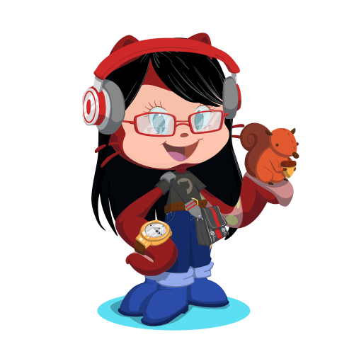

 
 
<h1 align="center" >Glad to see you here! </h1>

<h3>&nbsp;&nbsp;&nbsp;&nbsp;&nbsp;&nbsp;&nbsp;&nbsp;&nbsp;&nbsp;&nbsp;&nbsp; My name is Anette</h3>
<h4> &nbsp;&nbsp;&nbsp;&nbsp; Im a self-taught developer, from the UK, family centric, passionate about creating and designing websites </h4>
 

 

 <ul>
  <li>HTML | CSS | JavaScript | React </li>  
  <li>Goals: Front-End | Web Designer </li>
  <li>Learning: Full-Stack Development </li>
  <li>Member of Zero To Mastery </li>
  <li>Hobbies: Sport | Learning | Traveling | Music </li>
</ul>
 
 

 <h2><i>&nbsp;&nbsp;&nbsp;&nbsp;&nbsp;&nbsp; “Simplicity is the soul of efficiency.” </i> – Austin Freeman </h2>

&nbsp;&nbsp;&nbsp; [Build Your Own Octocat](https://myoctocat.com/)

